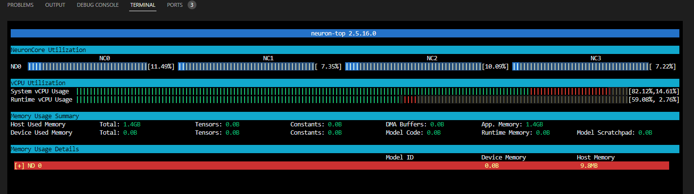

<div align="center">

## Deployment on AWS accelerators

</div>


Amazon EC2 Inf1 instances deliver high-performance ML inference at the lowest cost in the cloud. They deliver up to 2.3x higher throughput and up to 70% lower cost per inference than comparable current generation GPU-based Amazon EC2 instances. Inf1 instances are built from the ground up to support machine learning inference applications. Developers can deploy their machine learning models to Inf1 instances by using the [AWS Neuron SDK](https://awsdocs-neuron.readthedocs-hosted.com/), which is integrated with popular machine learning frameworks such as TensorFlow, PyTorch and MXNet.

### **How to run**

Here I will be deploying the Resnet18 model from the timm library trained on Cifar10 dataset on the AWS Inf1 servers. To deploy on AWS accelerators, first load your trained model and trace it using the AWS Neuron SDK. Then, using the traced model, deploy it using TorchServe.

```plaintext
# Login to ECR and pull the docker image
# Refer https://github.com/aws/deep-learning-containers/blob/master/available_images.md to get the right docker image
aws ecr get-login-password --region ap-south-1 | docker login --username AWS --password-stdin 763104351884.dkr.ecr.ap-south-1.amazonaws.com
docker pull 763104351884.dkr.ecr.ap-south-1.amazonaws.com/pytorch-inference-neuron:1.10.2-neuron-py37-sdk1.19.0-ubuntu18.04

# Run the docker using
docker run -it --name torchserve --rm --net=host --device=/dev/neuron0  --cap-add IPC_LOCK --entrypoint /bin/bash -v `pwd`:/opt/src 763104351884.dkr.ecr.ap-south-1.amazonaws.com/pytorch-inference-neuron:1.10.2-neuron-py37-sdk1.19.0-ubuntu18.04

# Trace the model
python src/trace_inferentia.py experiment=cifar10_example ckpt_path="model_checkpoint.ckpt"

# As I am using TorchServe, create a .mar file
torch-model-archiver --model-name cifar10_neuron --version 1.0 --serialized-file /opt/src/cifar10-net.neuron.traced.pt --handler /opt/src/lightning-hydra-timm/src/torch_handlers/cifar10_handler.py --extra-files /opt/src/lightning-hydra-timm/src/torch_handlers/cifa10_classes/index_to_name.json

# Start another docker container to deploy the .mar file. Refer https://github.com/gokul-pv/lightning-hydra-timm/blob/main/logBook/TorchServe.md for details. Once the container is running, install captum as the docker image does not come with it.
```

Checkout the logs I got below:

```plaintext
ubuntu@ip-172-31-16-184:~/lightning-hydra-timm$ curl http://localhost:8081/models/
{
  "models": [
    {
      "modelName": "cifar10_neuron",
      "modelUrl": "cifar10_neuron.mar"
    }
  ]
}
ubuntu@ip-172-31-16-184:~/lightning-hydra-timm$ curl http://localhost:8081/models/cifar10_neuron
[
  {
    "modelName": "cifar10_neuron",
    "modelVersion": "1.0",
    "modelUrl": "cifar10_neuron.mar",
    "runtime": "python",
    "minWorkers": 4,
    "maxWorkers": 4,
    "batchSize": 1,
    "maxBatchDelay": 100,
    "loadedAtStartup": false,
    "workers": [
      {
        "id": "9000",
        "startTime": "2022-11-09T04:04:18.613Z",
        "status": "READY",
        "memoryUsage": 0,
        "pid": 50,
        "gpu": false,
        "gpuUsage": "N/A"
      },
      {
        "id": "9001",
        "startTime": "2022-11-09T04:04:18.616Z",
        "status": "READY",
        "memoryUsage": 0,
        "pid": 53,
        "gpu": false,
        "gpuUsage": "N/A"
      },
      {
        "id": "9002",
        "startTime": "2022-11-09T04:04:18.616Z",
        "status": "READY",
        "memoryUsage": 0,
        "pid": 52,
        "gpu": false,
        "gpuUsage": "N/A"
      },
      {
        "id": "9003",
        "startTime": "2022-11-09T04:04:18.618Z",
        "status": "READY",
        "memoryUsage": 0,
        "pid": 51,
        "gpu": false,
        "gpuUsage": "N/A"
      }
    ]
  }
]
ubuntu@ip-172-31-16-184:~/lightning-hydra-timm$ pytest --public_ip 3.110.61.144 --model cifar10_neuron tests/test_serve/test_serve_rest.py -s
======================================================================================== test session starts =========================================================================================
platform linux -- Python 3.8.10, pytest-7.2.0, pluggy-1.0.0
rootdir: /home/ubuntu/lightning-hydra-timm, configfile: pyproject.toml
plugins: hydra-core-1.2.0, anyio-3.6.2
collected 1 item

tests/test_serve/test_serve_rest.py::test_serve_inference[3.110.61.144-cifar10_neuron] Testing image: /home/ubuntu/lightning-hydra-timm/tests/resources/cifar10/4_automobile.png
Response: {'automobile': 0.9999997615814209, 'truck': 2.6370423711341573e-07, 'cat': 1.344040612138997e-08, 'airplane': 5.723616025576916e-10, 'dog': 5.54751855563751e-10}
Predicted label: automobile and Confidence: 0.9999997615814209
=======================================================================

Testing image: /home/ubuntu/lightning-hydra-timm/tests/resources/cifar10/2_airplane.png
Response: {'airplane': 0.9999977350234985, 'truck': 1.7330506807411439e-06, 'bird': 2.785266133287223e-07, 'cat': 7.734404050552257e-08, 'ship': 6.02356067247456e-08}
Predicted label: airplane and Confidence: 0.9999977350234985
=======================================================================

Testing image: /home/ubuntu/lightning-hydra-timm/tests/resources/cifar10/0_cat.png
Response: {'cat': 0.9999994039535522, 'bird': 6.375548196047021e-07, 'dog': 3.12498720234089e-08, 'airplane': 1.8189605377472162e-09, 'frog': 1.1744092365262304e-09}
Predicted label: cat and Confidence: 0.9999994039535522
=======================================================================

Testing image: /home/ubuntu/lightning-hydra-timm/tests/resources/cifar10/1_ship.png
Response: {'ship': 0.9949193596839905, 'automobile': 0.004904541652649641, 'airplane': 0.00017587823094800115, 'truck': 2.0917521226238023e-07, 'bird': 6.25422547084753e-10}
Predicted label: ship and Confidence: 0.9949193596839905
=======================================================================

Testing image: /home/ubuntu/lightning-hydra-timm/tests/resources/cifar10/8_deer.png
Response: {'deer': 1.0, 'ship': 1.989356075704496e-11, 'bird': 5.219263064272506e-13, 'airplane': 3.4767785980945043e-13, 'frog': 1.5428111533547645e-13}
Predicted label: deer and Confidence: 1.0
=======================================================================

Testing image: /home/ubuntu/lightning-hydra-timm/tests/resources/cifar10/7_horse.png
Response: {'horse': 1.0, 'automobile': 6.90399959424326e-10, 'dog': 1.2378190139550327e-10, 'deer': 7.99195987166712e-11, 'frog': 1.0815941892117209e-11}
Predicted label: horse and Confidence: 1.0
=======================================================================

Testing image: /home/ubuntu/lightning-hydra-timm/tests/resources/cifar10/5_truck.png
Response: {'truck': 0.9999998807907104, 'automobile': 1.235956972323038e-07, 'ship': 6.10193590534075e-13, 'horse': 1.9810085375489977e-13, 'airplane': 5.279209500244153e-15}
Predicted label: truck and Confidence: 0.9999998807907104
=======================================================================

Testing image: /home/ubuntu/lightning-hydra-timm/tests/resources/cifar10/3_frog.png
Response: {'frog': 0.9969356060028076, 'automobile': 0.0027783955447375774, 'cat': 0.0002044357970589772, 'deer': 7.232656207634136e-05, 'bird': 8.114815500448458e-06}
Predicted label: frog and Confidence: 0.9969356060028076
=======================================================================

Testing image: /home/ubuntu/lightning-hydra-timm/tests/resources/cifar10/6_dog.png
Response: {'dog': 0.9996523857116699, 'deer': 0.00023228739155456424, 'cat': 0.00010718301928136498, 'horse': 8.136929864122067e-06, 'automobile': 7.655453160282377e-09}
Predicted label: dog and Confidence: 0.9996523857116699
=======================================================================

Testing image: /home/ubuntu/lightning-hydra-timm/tests/resources/cifar10/9_bird.png
Response: {'bird': 0.9999301433563232, 'dog': 5.85187335673254e-05, 'deer': 8.529798833478708e-06, 'cat': 1.2481852991186315e-06, 'horse': 9.720877187646693e-07}
Predicted label: bird and Confidence: 0.9999301433563232
=======================================================================

PASSED

========================================================================================= slowest durations ==========================================================================================
0.24s call     tests/test_serve/test_serve_rest.py::test_serve_inference[3.110.61.144-cifar10_neuron]

(2 durations < 0.005s hidden.  Use -vv to show these durations.)
========================================================================================= 1 passed in 0.31s ==========================================================================================
```

### Benchmarking

```plaintext
# Run
python src/utils/benchmark.py

# Output
pid 14381: current throughput 0.0, latency p50=0.000 p90=0.000
pid 14381: current throughput 184.9, latency p50=0.317 p90=0.374
pid 14381: current throughput 228.7, latency p50=0.272 p90=0.306
pid 14381: current throughput 222.1, latency p50=0.281 p90=0.326
pid 14381: current throughput 227.6, latency p50=0.274 p90=0.317
pid 14381: current throughput 226.9, latency p50=0.276 p90=0.323
pid 14381: current throughput 234.9, latency p50=0.267 p90=0.294
```



We can improve the performance by using batch inferencing. Checkout the [link](https://pytorch.org/serve/batch_inference_with_ts.html).

Further, if you want to customize the docker image, refer to this [link](https://github.com/aws-neuron/aws-neuron-sdk/blob/master/containers/docker-example/inference/Dockerfile-inference).

### Training on AWS Trn1

Training on Trn1 is very similar to TPUs and it even uses the same pytorch_xla library (modified)

Select DL AMI with Base Neuron Support

```plaintext
763104351884.dkr.ecr.us-west-2.amazonaws.com/pytorch-training-neuron:1.11.0-neuron-py38-sdk2.4.0-ubuntu20.04
```

### HPU Training (Habana Gaudi Accelerators)

Refer to this [link](https://pytorch-lightning.readthedocs.io/en/latest/accelerators/hpu_basic.html). Since the repo is well set up, the training is very simple, just do the following changes to the code to get it working.

```python
trainer = Trainer(accelerator="hpu", devices=1)
```

or for multiple accelerators

```python
trainer = Trainer(devices=8, accelerator="hpu")
```

or for multi node

```python
trainer = Trainer(accelerator="hpu", devices=8, strategy="hpu_parallel", num_nodes=2)
```

```python
MASTER_PORT - required; has to be a free port on machine with NODE_RANK 0
MASTER_ADDR - required (except for NODE_RANK 0); address of NODE_RANK 0 node
WORLD_SIZE - required; how many workers are in the cluster
NODE_RANK - required; id of the node in the cluster
```

If too much training sounds boring, checkout this [link](https://frontend-next-js-ten.vercel.app/) where both frontend and backend are serverless deployments.


