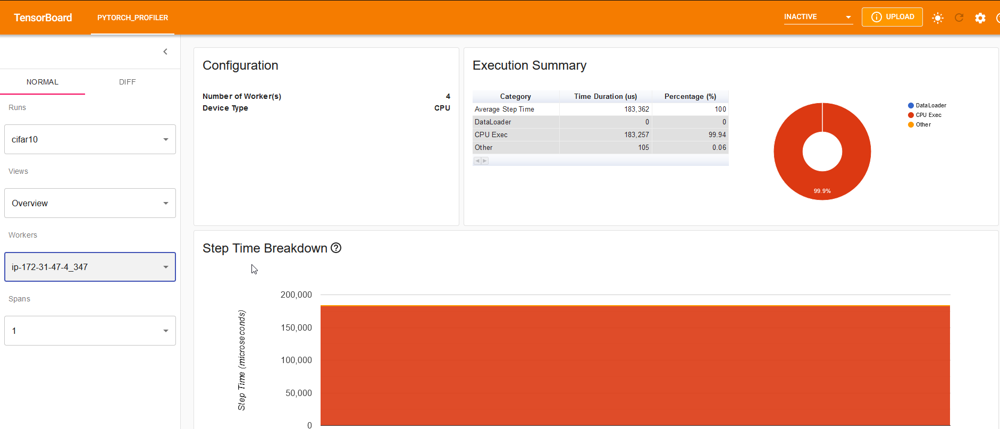

## Model Serving using TorchServe


To deploy your model using TorchServe, first train the model and save the scripted/traced checkpoint or normal checkpoint file. Create the `.mar` (Model Archive) File from the Scripted Model and deploy it. The steps for deploying a Renet18 timm model trained on cifar10 data are given below.

**How to run**

```plaintext
# Train and save scripted checkpoint
python src/train.py experiment=cifar10_example script=True

# Create the .mar file and save it in model_store folder under your directory
torch-model-archiver --model-name cifar10 --version 1.0 \
    --serialized-file "./lightning-hydra-timm/logs/train/runs/2022-11-04_13-10-49/model.scripted.pt" \
    --handler "./lightning-hydra-timm/src/torch_handlers/cifar10_handler.py" \
    --extra-files "./lightning-hydra-timm/src/torch_handlers/cifar10_classes/index_to_name.json"

# Set TorchServe on your system or use their docker container
docker run -it --rm --net=host -v `pwd`:/opt/src pytorch/torchserve:latest bash

# To start serving, run
torchserve --start --model-store model_store --models cifar10_model=cifar10.mar --ts-config config.properties

# To stop serving, run
torchserve --stop

# To get list of served models, run
curl "http://localhost:8081/models"

# To get predictions on cifar10 image, run
curl "http://127.0.0.1:8080/predictions/cifar10_model" -T ./tests/resources/cifar10/0_cat.png

# To view the api list in swagger UI, run the below command and open swagger.json in https://editor-next.swagger.io/
curl -X OPTIONS http://localhost:8080/ > swagger.json
```

**Setting up gRPC**

```plaintext
# Clone the following repo and install the dependencies
git clone https://github.com/pytorch/serve
cd serve
pip install -U grpcio protobuf grpcio-tools

# Create gRPC stubs for python using
python -m grpc_tools.protoc --proto_path=frontend/server/src/main/resources/proto/ --python_out=ts_scripts --grpc_python_out=ts_scripts frontend/server/src/main/resources/proto/inference.proto frontend/server/src/main/resources/proto/management.proto

# Test the gRPC inference using
python ts_scripts/torchserve_grpc_client.py infer cifar10_model ../lightning-hydra-template/tests/resources/cifar10/0_cat.png
```

### Testing the TorchServe Depolyment

To test the model deployment, run the test-case in the test_serve folder.

```plaintext
# Run the pytest test cases using
pytest --public_ip 3.108.221.28 --model cifar10_model --grpc_client /home/ubuntu/serve/ts_scripts/torchserve_grpc_client.py tests/test_serve/ -s
```

The output is shown below.

```plaintext
======================================================================================== test session starts ========================================================================================
platform linux -- Python 3.10.6, pytest-7.2.0, pluggy-1.0.0
rootdir: /home/ubuntu/lightning-hydra-timm, configfile: pyproject.toml
plugins: hydra-core-1.2.0, anyio-3.6.2
collected 3 items

tests/test_serve/test_serve_explain.py::test_serve_explain[35.154.222.185-cifar10_model] Testing image: /home/ubuntu/lightning-hydra-timm/tests/resources/cifar10/2_airplane.png
Response: {'airplane': 0.9985540509223938, 'bird': 0.0008776575559750199, 'ship': 0.0005511688650585711, 'automobile': 1.3729363672609907e-05, 'truck': 2.602669837870053e-06}
(224, 224, 3) (224, 224, 3)
PASSED
tests/test_serve/test_serve_grpc.py::test_serve_grpc_inference[cifar10_model-/home/ubuntu/serve/ts_scripts/torchserve_grpc_client.py] Testing image: /home/ubuntu/lightning-hydra-timm/tests/resources/cifar10/2_airplane.png
Response: {'airplane': 0.9985540509223938, 'bird': 0.0008776575559750199, 'ship': 0.0005511688650585711, 'automobile': 1.3729363672609907e-05, 'truck': 2.602669837870053e-06}
Predicted label: airplane and Confidence: 0.9985540509223938
=======================================================================

Testing image: /home/ubuntu/lightning-hydra-timm/tests/resources/cifar10/3_frog.png
Response: {'frog': 0.9999340772628784, 'cat': 5.581097138929181e-05, 'bird': 9.643697922001593e-06, 'deer': 3.933103300823859e-07, 'automobile': 7.562714188225073e-08}
Predicted label: frog and Confidence: 0.9999340772628784
=======================================================================

Testing image: /home/ubuntu/lightning-hydra-timm/tests/resources/cifar10/0_cat.png
Response: {'cat': 0.9999270439147949, 'frog': 2.502223833289463e-05, 'dog': 2.493208012310788e-05, 'bird': 1.9226739823352545e-05, 'airplane': 2.7500573196448386e-06}
Predicted label: cat and Confidence: 0.9999270439147949
=======================================================================

Testing image: /home/ubuntu/lightning-hydra-timm/tests/resources/cifar10/6_dog.png
Response: {'dog': 0.9303925633430481, 'cat': 0.06919330358505249, 'horse': 0.0002933298237621784, 'deer': 9.586747182765976e-05, 'bird': 2.2278516553342342e-05}
Predicted label: dog and Confidence: 0.9303925633430481
=======================================================================

Testing image: /home/ubuntu/lightning-hydra-timm/tests/resources/cifar10/7_horse.png
Response: {'horse': 0.9985889792442322, 'dog': 0.001347922720015049, 'cat': 4.5869091991335154e-05, 'deer': 9.545687134959735e-06, 'bird': 4.9791215133154765e-06}
Predicted label: horse and Confidence: 0.9985889792442322
=======================================================================

Testing image: /home/ubuntu/lightning-hydra-timm/tests/resources/cifar10/4_automobile.png
Response: {'automobile': 0.9999914169311523, 'truck': 5.851994956174167e-06, 'airplane': 1.5088448890310246e-06, 'cat': 9.965202707462595e-07, 'ship': 1.5524048535553447e-07}
Predicted label: automobile and Confidence: 0.9999914169311523
=======================================================================

Testing image: /home/ubuntu/lightning-hydra-timm/tests/resources/cifar10/5_truck.png
Response: {'truck': 0.9999942779541016, 'automobile': 5.693023013009224e-06, 'ship': 8.546890972738197e-10, 'airplane': 4.175854540627855e-12, 'cat': 1.5593614724127014e-12}
Predicted label: truck and Confidence: 0.9999942779541016
=======================================================================

Testing image: /home/ubuntu/lightning-hydra-timm/tests/resources/cifar10/1_ship.png
Response: {'ship': 0.999976396560669, 'automobile': 1.822249214455951e-05, 'airplane': 5.3129688240005635e-06, 'bird': 2.4285855104722032e-08, 'truck': 8.45152905992741e-11}
Predicted label: ship and Confidence: 0.999976396560669
=======================================================================

Testing image: /home/ubuntu/lightning-hydra-timm/tests/resources/cifar10/9_bird.png
Response: {'bird': 0.8757436871528625, 'cat': 0.08100038766860962, 'dog': 0.03771303594112396, 'frog': 0.0026084864512085915, 'horse': 0.0008856800850480795}
Predicted label: bird and Confidence: 0.8757436871528625
=======================================================================

Testing image: /home/ubuntu/lightning-hydra-timm/tests/resources/cifar10/8_deer.png
Response: {'deer': 0.9992808699607849, 'airplane': 0.00037820060970261693, 'bird': 0.00011520016414579004, 'frog': 9.491382661508396e-05, 'dog': 7.058497430989519e-05}
Predicted label: deer and Confidence: 0.9992808699607849
=======================================================================

PASSED
tests/test_serve/test_serve_rest.py::test_serve_inference[35.154.222.185-cifar10_model] Testing image: /home/ubuntu/lightning-hydra-timm/tests/resources/cifar10/2_airplane.png
Response: {'airplane': 0.9985540509223938, 'bird': 0.0008776575559750199, 'ship': 0.0005511688650585711, 'automobile': 1.3729363672609907e-05, 'truck': 2.602669837870053e-06}
Predicted label: airplane and Confidence: 0.9985540509223938
=======================================================================

Testing image: /home/ubuntu/lightning-hydra-timm/tests/resources/cifar10/3_frog.png
Response: {'frog': 0.9999340772628784, 'cat': 5.581097138929181e-05, 'bird': 9.643697922001593e-06, 'deer': 3.933103300823859e-07, 'automobile': 7.562714188225073e-08}
Predicted label: frog and Confidence: 0.9999340772628784
=======================================================================

Testing image: /home/ubuntu/lightning-hydra-timm/tests/resources/cifar10/0_cat.png
Response: {'cat': 0.9999270439147949, 'frog': 2.502223833289463e-05, 'dog': 2.493208012310788e-05, 'bird': 1.9226739823352545e-05, 'airplane': 2.7500573196448386e-06}
Predicted label: cat and Confidence: 0.9999270439147949
=======================================================================

Testing image: /home/ubuntu/lightning-hydra-timm/tests/resources/cifar10/6_dog.png
Response: {'dog': 0.9303925633430481, 'cat': 0.06919330358505249, 'horse': 0.0002933298237621784, 'deer': 9.586747182765976e-05, 'bird': 2.2278516553342342e-05}
Predicted label: dog and Confidence: 0.9303925633430481
=======================================================================

Testing image: /home/ubuntu/lightning-hydra-timm/tests/resources/cifar10/7_horse.png
Response: {'horse': 0.9985889792442322, 'dog': 0.001347922720015049, 'cat': 4.5869091991335154e-05, 'deer': 9.545687134959735e-06, 'bird': 4.9791215133154765e-06}
Predicted label: horse and Confidence: 0.9985889792442322
=======================================================================

Testing image: /home/ubuntu/lightning-hydra-timm/tests/resources/cifar10/4_automobile.png
Response: {'automobile': 0.9999914169311523, 'truck': 5.851994956174167e-06, 'airplane': 1.5088448890310246e-06, 'cat': 9.965202707462595e-07, 'ship': 1.5524048535553447e-07}
Predicted label: automobile and Confidence: 0.9999914169311523
=======================================================================

Testing image: /home/ubuntu/lightning-hydra-timm/tests/resources/cifar10/5_truck.png
Response: {'truck': 0.9999942779541016, 'automobile': 5.693023013009224e-06, 'ship': 8.546890972738197e-10, 'airplane': 4.175854540627855e-12, 'cat': 1.5593614724127014e-12}
Predicted label: truck and Confidence: 0.9999942779541016
=======================================================================

Testing image: /home/ubuntu/lightning-hydra-timm/tests/resources/cifar10/1_ship.png
Response: {'ship': 0.999976396560669, 'automobile': 1.822249214455951e-05, 'airplane': 5.3129688240005635e-06, 'bird': 2.4285855104722032e-08, 'truck': 8.45152905992741e-11}
Predicted label: ship and Confidence: 0.999976396560669
=======================================================================

Testing image: /home/ubuntu/lightning-hydra-timm/tests/resources/cifar10/9_bird.png
Response: {'bird': 0.8757436871528625, 'cat': 0.08100038766860962, 'dog': 0.03771303594112396, 'frog': 0.0026084864512085915, 'horse': 0.0008856800850480795}
Predicted label: bird and Confidence: 0.8757436871528625
=======================================================================

Testing image: /home/ubuntu/lightning-hydra-timm/tests/resources/cifar10/8_deer.png
Response: {'deer': 0.9992808699607849, 'airplane': 0.00037820060970261693, 'bird': 0.00011520016414579004, 'frog': 9.491382661508396e-05, 'dog': 7.058497430989519e-05}
Predicted label: deer and Confidence: 0.9992808699607849
=======================================================================

PASSED

========================================================================================= slowest durations =========================================================================================
1.96s call     tests/test_serve/test_serve_explain.py::test_serve_explain[35.154.222.185-cifar10_model]
1.50s call     tests/test_serve/test_serve_grpc.py::test_serve_grpc_inference[cifar10_model-/home/ubuntu/serve/ts_scripts/torchserve_grpc_client.py]
0.37s call     tests/test_serve/test_serve_rest.py::test_serve_inference[35.154.222.185-cifar10_model]

(6 durations < 0.005s hidden.  Use -vv to show these durations.)
========================================================================================= 3 passed in 5.28s =========================================================================================
```

The model explanation image is shown below.

| Original Image                                                                                                                                                                                         | Model explanation image                                                                                                                                                                                   |
| ------------------------------------------------------------------------------------------------------------------------------------------------------------------------------------------------------ | --------------------------------------------------------------------------------------------------------------------------------------------------------------------------------------------------------- |
| <p align="center" style="padding: 10px"><br></p> | <p align="center" style="padding: 10px"><br></p> |

The inference matrix is shown as below.

```plaintext
# Run the curl command as
curl http://127.0.0.1:8082/metrics

#OUTPUT
# HELP ts_inference_latency_microseconds Cumulative inference duration in microseconds
# TYPE ts_inference_latency_microseconds counter
ts_inference_latency_microseconds{uuid="d70da642-917f-40d1-a45a-0a8af733b645",model_name="cifar10_model",model_version="1.0",} 5484021.691000001
# HELP ts_inference_requests_total Total number of inference requests.
# TYPE ts_inference_requests_total counter
ts_inference_requests_total{uuid="d70da642-917f-40d1-a45a-0a8af733b645",model_name="cifar10_model",model_version="1.0",} 36.0
ts_inference_requests_total{uuid="d70da642-917f-40d1-a45a-0a8af733b645",model_name="cifar10_model",model_version="default",} 11.0
# HELP ts_queue_latency_microseconds Cumulative queue duration in microseconds
# TYPE ts_queue_latency_microseconds counter
ts_queue_latency_microseconds{uuid="d70da642-917f-40d1-a45a-0a8af733b645",model_name="cifar10_model",model_version="1.0",} 3991.0610000000006
```

To enable profiling, do the following

```plaintext
# In config.properties, add
enable_envvars_config=true

# Set the environment var
export ENABLE_TORCH_PROFILER=true

# Run torchServe using
torchserve --start --model-store model_store --models cifar10_model=cifar10.mar --ts-config config.properties
```

To view the profiling output in tensorboard

```plaintext
# Install
pip install torch-tb-profiler

# Copy the profiler data insid the torchserve docker to host
cp -r /tmp/pytorch_profiler /opt/src

# View the logs using
tensorboard --logdir pytorch_profiler/cifar10/ --bind_all
```




### TorchServe in Production Environment

For production deployment refer this [link](https://github.com/pytorch/serve/blob/master/docker/README.md#running-torchserve-in-a-production-docker-environment).

```plaintext
# Run the command
docker run --rm -it \
        --shm-size=1g \
        --ulimit memlock=-1 \
        --ulimit stack=67108864 \
        -p8080:8080 \
        -p8081:8081 \
        -p8082:8082 \
        -p7070:7070 \
        -p7071:7071 \
        -v /home/ubuntu/lightning-hydra-timm/model_store:/tmp/models \
        pytorch/torchserve:latest torchserve --model-store=/tmp/models --ts-config /tmp/models/config.properties

# Register the model from S3 using
curl -X POST  "http://localhost:8081/models?url=https://myemlobucket.s3.ap-south-1.amazonaws.com/torchServeModels/cifar10.mar&model_name=cifar10_model"

# Scale the workers using
curl -v -X PUT "http://localhost:8081/models/cifar10_model?min_worker=2"
```

See the logs [here](./resources/procution_log.txt).

To check if the deployment is correct, run the test cases in another docker container as below

```plaintext
# To build the docker container
make build-train

# Run the docker using
# Note: Mount the gRPC folder for the test cases to pass. Also add the public IP of the deployment in the infer function of torchserve_grpc_client.py
docker run -it --rm \
	-v /home/ubuntu/serve/:/tmp \
	gokulpv/lighteninghydratimm \
	pytest --public_ip 65.0.93.168 --model cifar10_model \
		--grpc_client /tmp/ts_scripts/torchserve_grpc_client.py \
		tests/test_serve/ -s
```
